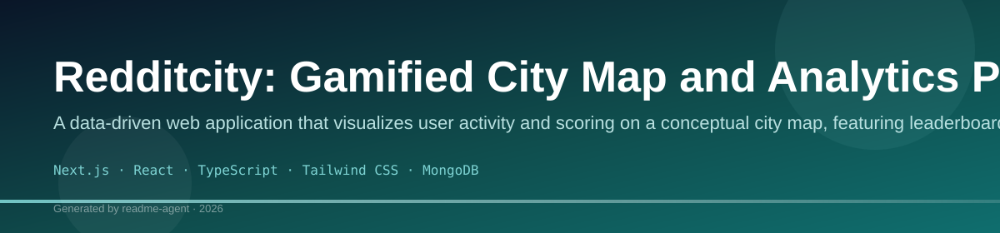
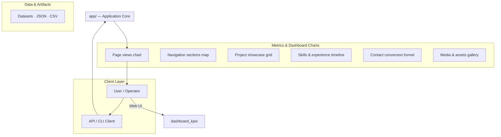
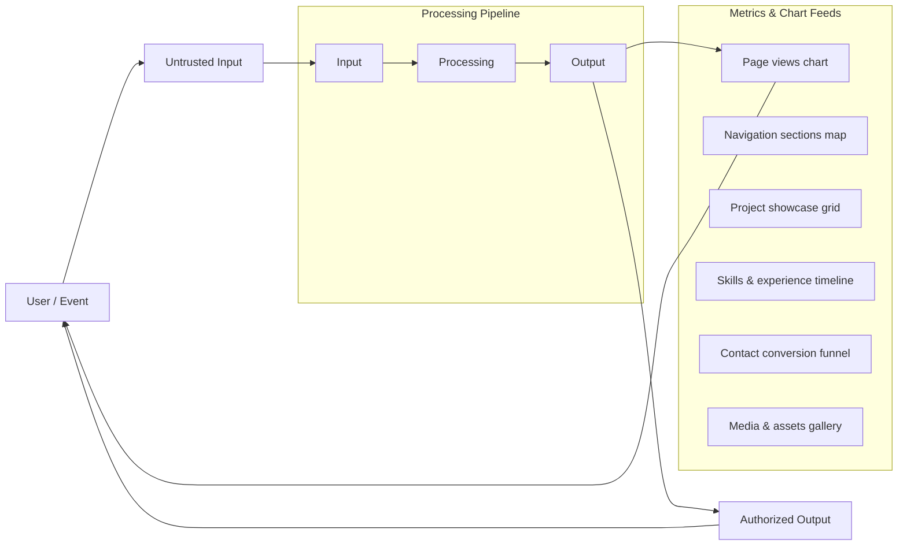
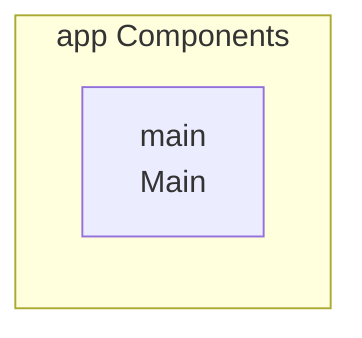
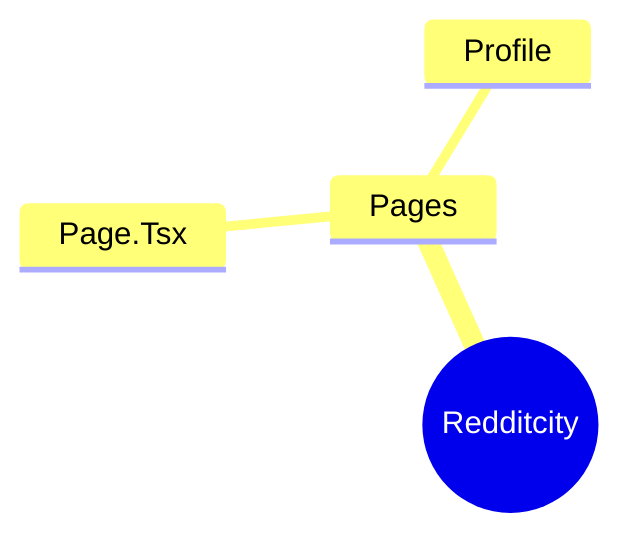
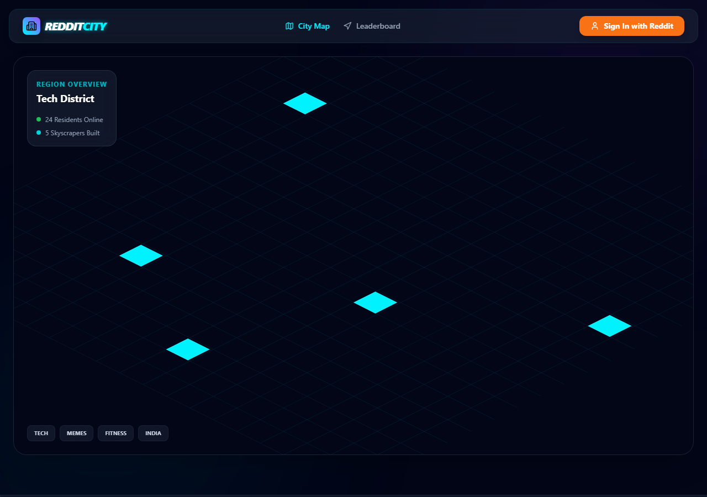

# Redditcity

This is a [Next.js](https://nextjs.org) project bootstrapped with [`create-next-app`](https://nextjs.org/docs/app/api-reference/cli/create-next-app).

## Technology Stack

- TypeScript
- JavaScript
- CSS
- npm

## Redditcity

This is a Next.js project bootstrapped with `create-next-app`.

## Overview

This is a Next.js project bootstrapped with `create-next-app`.

## Tech Stack

*   TypeScript
*   JavaScript
*   CSS
*   npm

## Getting Started

### Installation

To get started, install the required dependencies:

```bash
npm install
```

### Usage

To run the application locally:

```bash
npm run dev
```

To build the application for production:

```bash
npm run build
```

To start the production server:

```bash
npm run start
```

To run linting checks:

```bash
npm run lint
```

## Features

*   **City Map Visualization:** Utilizes the `components/CityMap.tsx` component for displaying geographical data.
*   **Leaderboard Display:** Features a dedicated `components/Leaderboard.tsx` component for ranking users.
*   **Data Management:** Includes utility functions for scoring (`utils/cityScore.ts`) and seeding data (`utils/seed.ts`).

## Project Structure

The project structure includes the following directories and files:

*   `.gitignore`
*   `README.md`
*   `eslint.config.mjs`
*   `next.config.js`
*   `package-lock.json`
*   `package.json`
*   `postcss.config.js`
*   `tailwind.config.js`
*   `tmp_output.txt`
*   `tsconfig.json`
*   `api/` (Contains `api/server.ts`)
*   `app/` (Contains `app/favicon.ico`, `app/globals.css`, `app/layout.tsx`, `app/page.tsx`)
*   `components/` (Contains `components/CityMap.tsx`, `components/Leaderboard.tsx`)
*   `lib/` (Contains `lib/mongodb.ts`, `lib/utils.ts`)
*   `models/` (Contains `models/User.ts`)
*   `public/` (Contains `public/file.svg`, `public/globe.svg`, `public/next.svg`, `public/vercel.svg`, `public/window.svg`)
*   `utils/` (Contains `utils/cityScore.ts`, `utils/seed.ts`)

## API Endpoints

*   **`api/server.ts`**: Handles server-side logic and API requests.

## Setup Guide

### Frontend Setup

```bash

npm install
npm run dev     # development
npm run build && npm start   # production
```

Open `http://127.0.0.1:3000` (or the port shown in the terminal).

### Running the Application

1. **Start web app** — `npm run dev` in `./`

```bash
cd .
npm install
npm run dev
```

## System Architecture

High-level system design, data flows, API map, and workflow pipelines derived from the repository structure.

### System Architecture



### Data Flow & Charts Pipeline



### Component & API Map



### Application Page Map



## Application Pages

Screenshots captured from the running application. Each page is listed with its function.

#### Home

Application page at `/`


